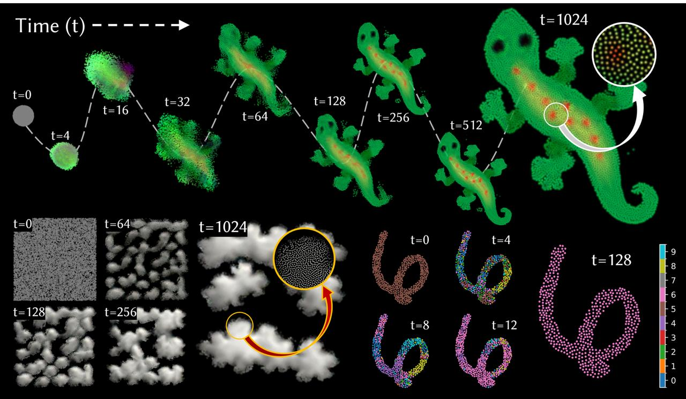

# Neural Particle Automata: Learning Self-Organizing Particle Dynamics

[](https://selforg-npa.github.io/)
[](https://arxiv.org/abs/2601.16096)
[]()
[](https://colab.research.google.com/github/TheDevilWillBeBee/NPA/blob/main/notebooks/growing.ipynb)



Official implementation of **Neural Particle Automata: Learning Self-Organizing Particle Dynamics** (SIGGRAPH 2026).

## Installation

```bash
pip install -r requirements.txt
```

### Compiling the CUDA kernels

We use [nanobind](https://github.com/wjakob/nanobind) to bind the CUDA kernels.

```bash
cd sphops
./build.sh      # Linux
./build.ps1     # Windows
```

The code has been tested across multiple CUDA and PyTorch versions. For best results we recommend **CUDA 13.0** and **PyTorch 2.12**. After building, run the test suite to verify the kernels compiled correctly and pass the numerical correctness tests:

```bash
python3 test.py
```

## Training

```bash
python3 train.py --config configs/growing.yaml
python3 train.py --config configs/texture.yaml
python3 train_dataset.py --config configs/point_mnist.yaml
python3 train_3dgs.py --config configs/growing-3dgs.yaml # Download dataset first
```

All training configs except `growing-3dgs.yaml` can run on RTX 2080 with 8GB VRAM.
For `growing-3dgs.yaml`, reduce `batch_size` in the config to fit in the small VRAM GPUs.

You can also run the growing experiment end-to-end in your browser (no local setup) via the Colab notebook: [](https://colab.research.google.com/github/TheDevilWillBeBee/NPA/blob/main/notebooks/growing.ipynb)
## Web Demo

To deploy trained models on the interactive web demo, see [SelfOrg-NPA/SelfOrg-NPA.github.io](https://github.com/SelfOrg-NPA/SelfOrg-NPA.github.io).

## Data

We provide two pretrained models in `data/pretrained`:

- `lizard.pth` — Growing a morphology experiment
- `polka_dotted.pth` — Texture experiment

Set `graft_path` in your config to one of these models to improve training stability and convergence.

The transparent texture dataset can be [downloaded here](https://drive.google.com/file/d/1awJVK4m94qKkfc8jWLbR20OKjFL-52sh/view?usp=sharing) and should be placed in `data/transparent_textures`.

For 3DGS morphogenesis, `nerf-synthetic` dataset can be [downloaded here](https://www.matthewtancik.com/nerf) and should be placed in `data/nerf_synthetic`. 

For PointMNIST classification, the code will automatically download MNIST dataset and convert to PointMNIST on the first run.
Later runs will use cached PointMNIST dataset saved in `data/point-MNIST-512`.

## TODO

- [x] Google Colab notebook
- [x] Self-classifying particles experiment
- [x] Growing a 3D morphology using Gaussian splats
